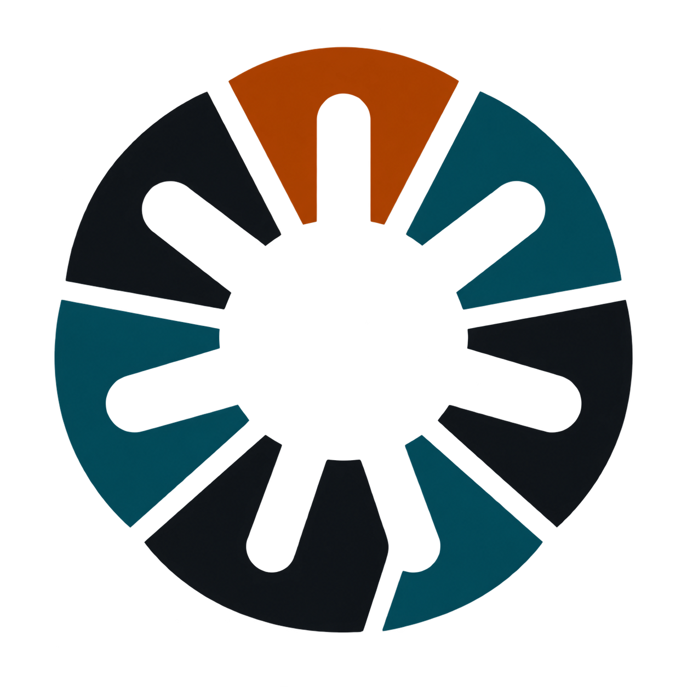
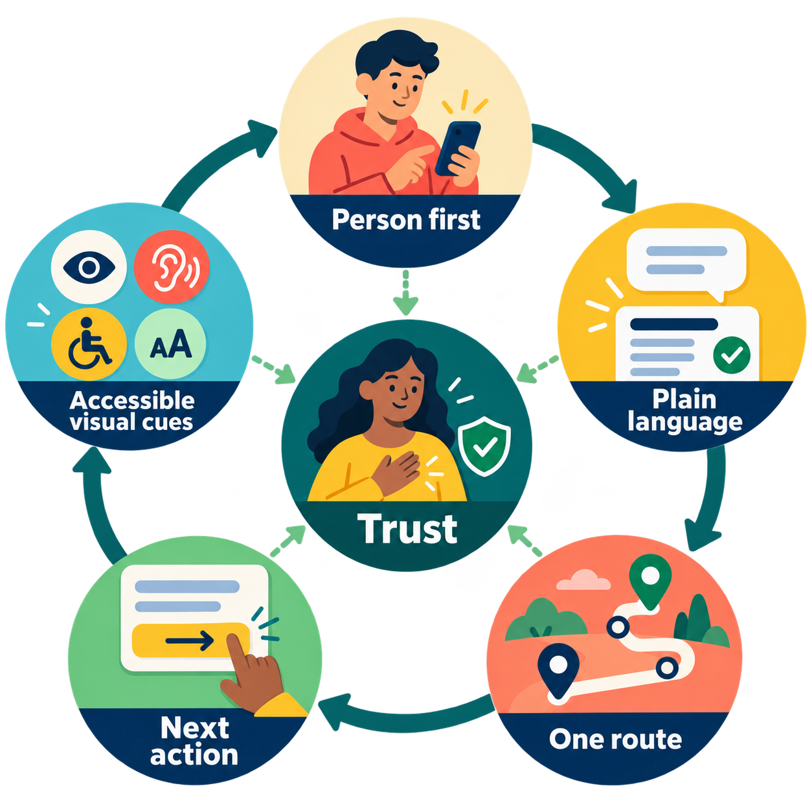
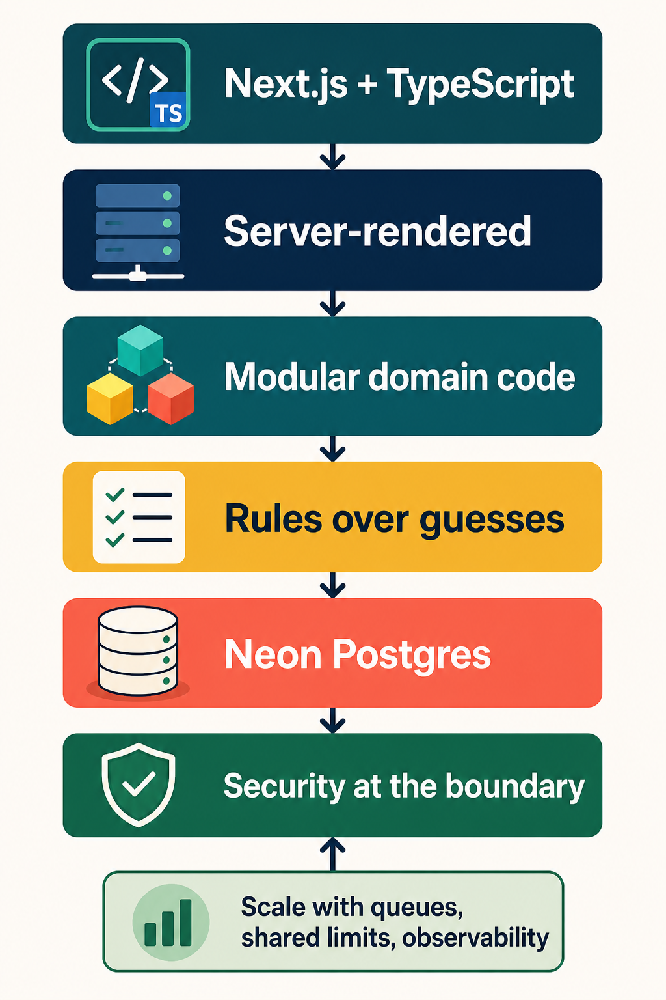
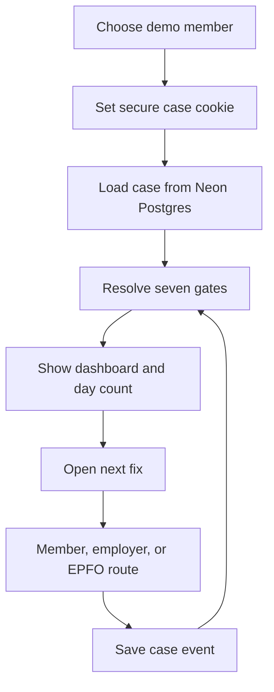
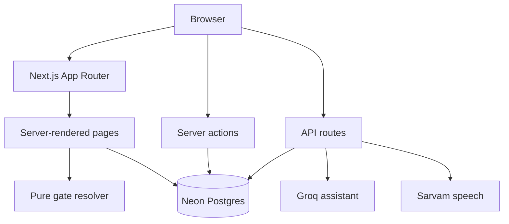
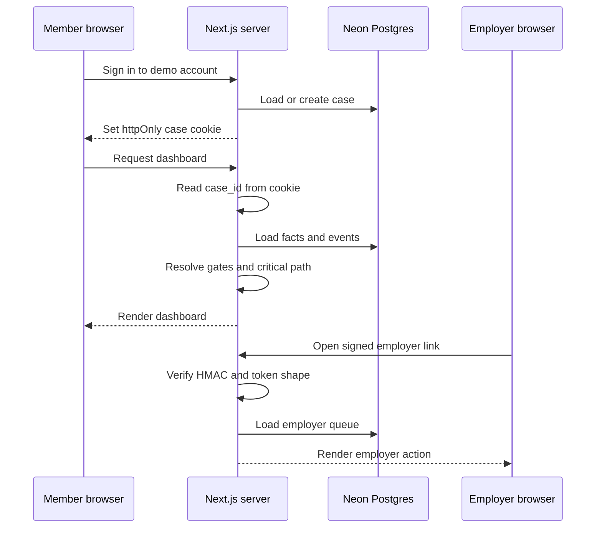
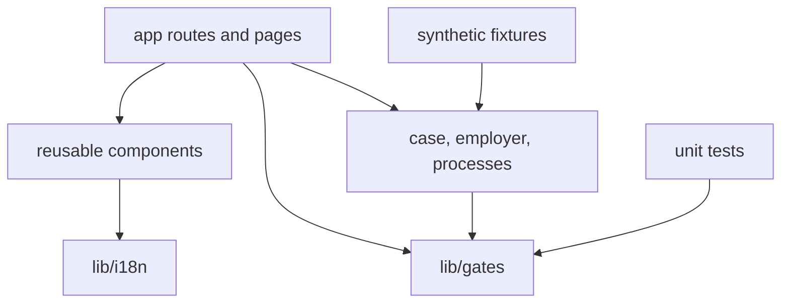

# Seven Gates

<p align="center"></p>
<p align="center"><strong>Find out what blocks an EPF withdrawal before filing, not after rejection.</strong></p>

Seven Gates is an independent hackathon proof of concept for people trying to withdraw Employees' Provident Fund (EPF) savings. It brings checks scattered across several portals into one clear route: what is wrong, who must fix it, and how much time the step may add.

It is not EPFO, is not connected to EPFO, and is not endorsed by EPFO or any government body. No real Aadhaar, PAN, bank, employer, or EPFO data is used.

Built for the [Build What Moves India hackathon](https://buildwhatmovesindia.com/). Try the [live deployment](https://build-whatmovesindia.vercel.app/) or browse the [source on GitHub](https://github.com/AfreenInnovates/build-what-moves-india).

## The problem

An EPF claim can fail because one person is written differently on different records. A bank record may contain an extra initial, a date of birth may differ, or an old employer may need to approve a correction. The member normally sees only one record at a time, moves between separate sites, and learns about one problem only after waiting for a claim to fail.

This is both a technical and a communication problem. People need to know which record differs, who can change it, whether another fix depends on it, and what to do next.

<p align="center"></p>

The illustration above is a visual summary of the product: scattered records enter a sequence of checks, the right person is brought into the route when needed, and the member reaches a clear hand-off instead of a mysterious rejection.

## The solution

Seven Gates is a pre-flight check:

1. Choose a demo member account.
2. See all seven checks together.
3. Compare Aadhaar, PAN, bank, and EPFO-style fields.
4. Start with the unresolved gate on the critical path.
5. Follow a plain-language route for the person who must act.
6. See the estimated working-day count change as gates clear.

The product is diagnosis-first. It does not pretend to file a real claim. It helps a member reach the point where filing on EPFO's own portal is less likely to fail for a problem they could have found earlier.

When all seven checks are clear, the dashboard now offers a **mock claim hand-off**. The member can submit it, receive a demo reference, and see that submission saved against their case. This models the final product step without claiming to file with EPFO or move money. The existing reset action clears the mocked submission as well as the cleared gates, returning the demo member to its original state.

## Design choices

### Product choices

<p align="center"></p>

The product decisions follow a simple cycle: start with the person using the service, reduce language and navigation effort, make the next action obvious, and earn trust through accessible feedback. The written choices below explain how that cycle appears in the product.

- **Plain language before portal language.** People are dealing with their savings, often on a small phone. We use short explanations, visible next actions, and a clear actor: you, your employer, or EPFO.
- **One connected route.** The real process is split across sites. The dashboard puts the seven checks, their dependencies, and the day estimate in one place.
- **A small visual system.** Teal anchors the product in a public-service context without pretending to be an official government site. Accent colours separate progress, waiting, and action. Cards and spacing keep dense information readable.
- **Icons with labels.** Icons help scanning, but every important action also has text for clarity and accessibility.
- **Synthetic data by default.** Demo records are invalid and watermarked. This keeps the product safe to show and makes failure cases repeatable.

**Future product choices:** Keep the first screen calm with progressive disclosure, add stronger keyboard navigation and larger touch targets, support low-bandwidth use, and provide downloadable check summaries that a member can share with an employer without sharing the whole case.

### Technology choices

<p align="center"></p>

The technology choices move from the outer interface toward durable, testable foundations. Each layer creates a boundary that can be measured and replaced independently as the proof of concept grows.

- **Next.js and TypeScript.** One strongly typed codebase keeps pages, server routes, and actions close together and easy to review.
- **Neon Postgres.** A durable database makes cases and progress survive refreshes and returning visits.
- **Modular domain code.** The gate specification, predicates, resolver, language layer, and screens are separate modules with clear boundaries.
- **Server-rendered by default.** Case pages keep personal state on the server and reduce unnecessary browser copies.
- **Rules over guesses.** The critical path and day count come from a deterministic resolver. A language model can explain a result, but cannot invent it.
- **Security at the boundary.** Cookies, validation, parameterised SQL, API guards, and server-only secrets are handled before business logic runs.

**Future technology choices:** Use shared design tokens if the product splits into more apps, move slow work to queues, put rate limits in shared storage, add observability before increasing traffic, and scale stateless web instances behind a load balancer.

## What we built

The member experience includes six synthetic demo accounts, a persistent case, a seven-gate dashboard, field-by-field comparison, guided fixes, Hindi and Kannada support, and Saathi text and voice assistance.

We also built working stand-ins where a member cannot access or safely automate a government system: a DigiLocker-shaped structured-document flow, a UMANG face-authentication activation flow with no camera, EPFO-style member screens, and an employer queue with signed shared links. These are not live connections.

## Product flow



Every action updates the case facts and runs the resolver again. A button press alone never decides that a gate is complete.

## Architecture



The browser is intentionally thin. The server owns case identity, business rules, database access, and third-party credentials.

## Backend design

### Case identity and employer links

The signed-in case is identified by an `httpOnly`, `sameSite` cookie named `case_id`. Browser JavaScript cannot read it. Server actions and API routes read it directly and fail closed when it is missing.

Employer links contain a signed employer token and a request reference, not a member case ID. The server validates the token shape, verifies its HMAC using a timing-safe comparison, derives the establishment, and then loads only its queue.



### Database

Neon-hosted Postgres is the source of truth for members, cases, facts, progress events, employer requests, and assistant messages. Queries use parameters instead of string-built SQL. The connection pool is kept in a development-safe global so hot reload does not leak connections.

The demo uses a small pool against Neon. A production deployment would add Neon’s managed pooling where appropriate, migrations, backups, connection monitoring, and query-latency dashboards.

### Third-party services

Groq and Sarvam are called only from server routes. The assistant route loads the case from the cookie, validates and limits input, sends only the needed case context, and streams the answer. Speech routes send text or audio and return the result. API keys stay in server environment variables and never enter browser bundles.

## Code architecture



`app/` defines routes and server boundaries. `components/` keeps shared UI, navigation, icons, assistant controls, and dashboard pieces reusable. `lib/gates/` contains the data-driven gate specification, predicates, types, resolver, and tests. `fixtures/` makes failure patterns reproducible. `lib/i18n/` provides checked-in dictionaries with an English fallback.

The resolver is pure: facts go in and an ordered resolution comes out. It performs no I/O and uses a topological sort plus a critical-path calculation. This makes the result deterministic, inspectable, and independent of any language model.

### AI-assisted development and generated assets

This project was built with OpenAI Codex using GPT-5.6 Luna and GPT-5.6 Terra at medium reasoning effort. 

For the decisions behind the implementation and the one model correction we caught during review, see the [build log](docs/BUILD-LOG.md).

Generated visual assets are kept in the repository so they are inspectable and versioned:

- [Seven Gates logo](public/seven-gates-logo.png) used in the navbar and browser icon.
- [App icon](app/icon.png) and [favicon](app/favicon.ico) derived from the same logo asset.
- [Home page paper-flow artwork](public/images/home-paperflow.webp).
- [Home page voice-wave artwork](public/images/home-voice-waves.webp).
- [Home page guided-route artwork](public/images/home-guided-route.webp).
- [README product-choice cycle](public/images/readme-product-choices.png).
- [README technology-choice flow](public/images/readme-technology-choices.png).
- [README product-flow overview](public/images/readme-gates-overview.png).

## Security approach

Security is handled at several boundaries:

- Case identity comes from a server cookie, never a client-provided case ID.
- Cookies are `httpOnly` and same-site.
- Employer tokens use HMAC signatures and timing-safe verification.
- JSON bodies are parsed through shared guards and assistant messages have a size limit.
- Assistant, speech, and listening routes have fixed-window rate limits.
- SQL uses parameterised queries.
- API keys are server-only environment variables.
- Missing or invalid case state fails closed.
- API and dashboard responses are marked `no-store`.
- Content Security Policy restricts scripts, styles, images, media, connections, forms, frames, and objects.
- `X-Frame-Options: DENY` blocks framing.
- `X-Content-Type-Options: nosniff` reduces content-type confusion.
- Strict referrer policy limits information sent to other sites.
- Permissions Policy disables camera, geolocation, payment, and USB access; microphone is limited to this origin.
- HSTS tells browsers to prefer HTTPS on future requests.

The current in-memory rate limiter is suitable as a demo guardrail, not as a production defence. Before a public launch we would add shared rate-limit storage, central audit logs, dependency scanning, automated security tests, secret rotation, alerting, and a formal threat model.

## Why the code is maintainable

The project favours small, inspectable pieces. Business rules are data. API routes are narrow. UI primitives prevent navigation and focus behaviour from drifting. Types describe module boundaries. Synthetic fixtures make bugs reproducible. Comments explain security and performance decisions. A reader can follow a fact from fixture, to case, to resolver, to rendered gate without tracing a large component or hidden model prompt.

## Scaling plan

The proof of concept has a small pool and in-memory limits, but its boundaries leave a practical production path:

1. Use Neon’s managed connection pooling and add read replicas only when measurements justify them.
2. Move rate limits and coordination state to shared Redis or an equivalent service.
3. Keep Next.js instances stateless and scale them horizontally behind a load balancer.
4. Move slow integrations to durable queues with retries and dead-letter handling.
5. Add structured logs, traces, metrics, and alerts before adding traffic.
6. Add stronger sessions, key rotation, audit trails, backup testing, and regional failover.
7. Load-test the resolver, queries, employer queue, and assistant routes independently.

These changes fit behind existing boundaries. The UI does not need to know whether a limiter is in memory or shared, and the resolver does not need to know whether the database has one instance or many.

## Routes

| Route | Purpose |
|---|---|
| `/` | Product explanation and demo entry |
| `/login` | Demo member and employer selection |
| `/dashboard` | Signed-in member case |
| `/dashboard/actions` | Ordered actions for unresolved gates |
| `/dashboard/records` | Synthetic records and evidence |
| `/compare` | EPFO comparison with sources |
| `/whats-mocked` | What is real, rebuilt, mocked, synthetic, estimated, or not built |
| `/technology` | Engineering, security, and scaling details |

## Running locally

### Use the hosted demo

Open the [live deployment](https://build-whatmovesindia.vercel.app/). This is the quickest way to explore Seven Gates without setting up a database or API keys.

### Clone and run the project

```bash
git clone https://github.com/AfreenInnovates/build-what-moves-india.git
cd build-what-moves-india
npm install
npm run dev
```

The development server is then available at [http://localhost:3000](http://localhost:3000).

### Environment setup

Copy `.env.example` to `.env` and provide the Neon `DATABASE_URL`, `GROQ_API_KEY`, and `SARVAM_API_KEY` as needed.

| Command | Purpose |
|---|---|
| `npm run dev` | Start development server |
| `npm run build` | Create a production build |
| `npm run start` | Run the production build |
| `npm run lint` | Run ESLint |
| `npm test` | Run unit tests |
| `npm run db:seed` | Seed six demo members |
| `npm run db:migrate` | Apply migrations |
| `npm run db:dump` | Inspect database contents |
| `npm run fixtures:build` | Regenerate synthetic documents |
| `npm run spine` | Print each member's gate spine |

## Scope and status

Seven Gates is a working demonstration of the product idea and its core technical approach. It does not file claims, authenticate Aadhaar, contact EPFO, send SMS, verify bank accounts, or use real member documents. That boundary is intentional: the prototype demonstrates how to find and explain blockers without pretending to be a government service.

## License

Seven Gates is released under the [MIT License](LICENSE). You may use, copy, modify, and redistribute the project, provided the copyright and license notice are retained. The software is provided without warranty.
